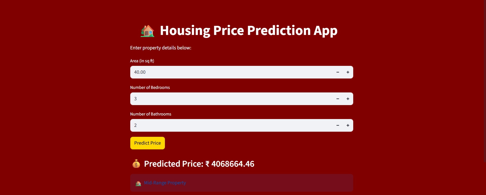
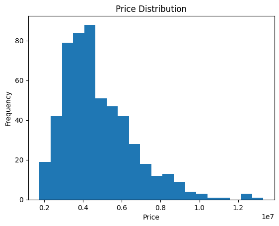
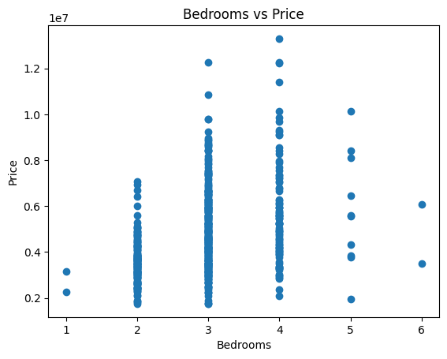
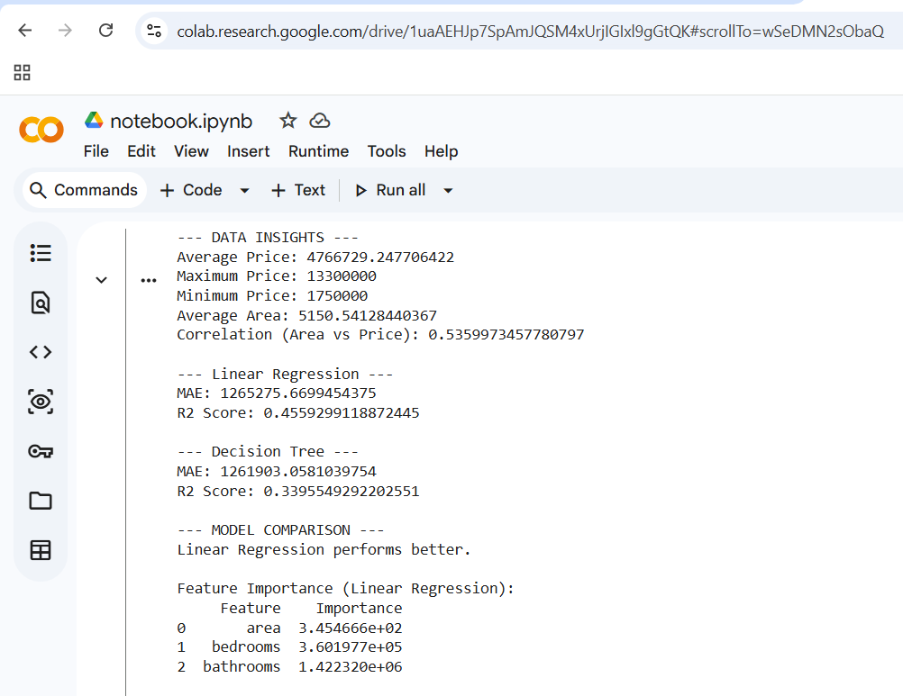

# Smart Housing Price Prediction Web App

This project is a machine learning-based system that predicts housing prices using features such as area, number of bedrooms, and bathrooms. It includes both data analysis and an interactive web application for real-time predictions.

---

## Features

- Exploratory Data Analysis (EDA) on housing dataset  
- Data visualization (price distribution and feature relationships)  
- Machine Learning models:
  - Linear Regression  
  - Decision Tree Regressor  
- Model evaluation using MAE and R² score  
- Model comparison to identify best-performing model  
- Feature importance analysis  
- Interactive Streamlit web application  
- Real-time user input for prediction  
- Property categorization (Budget, Mid-range, Expensive)  

---

## Tech Stack

- Python  
- Pandas  
- Scikit-learn  
- Matplotlib  
- Streamlit  

---

## Project Structure

Housing-Price-Prediction/
│
├── app.py
├── Housing.csv
├── notebook.ipynb
├── requirements.txt
├── areavspric e.png
├── bedroomsvsprice.png
├── price.png
├── model_results.png
├── Screenshot 2026-05-05 193836.png

---

## How to Run

1. Install dependencies:

pip install -r requirements.txt

2. Run the application:

python -m streamlit run app.py

---

## Screenshots

### Web App Interface

### Price Distribution

### Area vs Price

### Bedrooms vs Price

### Model Evaluation

---

## Key Insights

- Area has a positive correlation with housing price  
- Linear Regression performed better than Decision Tree for this dataset  
- Features like area, bedrooms, and bathrooms significantly impact price  

---

## Conclusion

This project demonstrates an end-to-end machine learning workflow including data analysis, model building, evaluation, and deployment as an interactive web application.

---

## Author

Aparna Padhy
